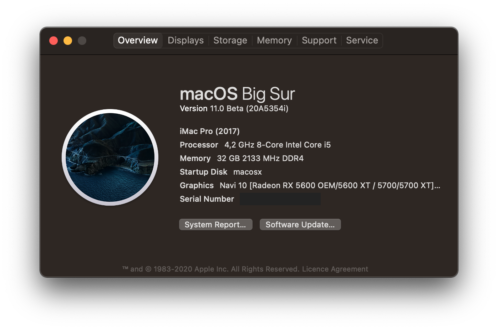

# AMD Ryzen Hackintosh - Opencore EFI for Asus TUF Gaming x570-Plus (WIFI)

I’ve been experimenting with hackintosh since I got my PC and over the past few months I think I got stable and performing well enough, and have been using it as a daily driver for quite some time now.

## Build Specs

**MB** | Asus TUF Gaming x570-Plus (WIFI)

**Processor** | AMD Ryzen 7 3800X 8-Core Processor

**Graphics** | Radeon RX 5700 XT

**Memory** | Corsair 32GB KIT DDR4 3200MHz CL16 Vengeance RGB PRO Series

**Storage** | NVMe Samsung SSD 970 EVO 1TB

## Status
Everything is working just fine **except**

~~-Sleep~~ **(Fixed with Big Sur!)**

- Android Studio emulator “Normally, it’s not expected to work on AMD based hackintoshes and can be replaced with Genymotion”
- VirtualBox, as Big Sur is still in dev beta it's not yet clear when VBox support might arrive.
- AMD Power Gadget, Big Sur isn't supported yet **`AMDRyzenCPUPowerManagement.kext` causes kernel panic**

## Performance
The performance is good enough for me, whenever I hit some kind of a wall on something and can’t figure out why it isn’t performing well enough, I just switch to my Linux installation as I run a dual-boot.

~~I don’t give much thought to benchmarking as it can be very unhealthy obsession as I noticed :D . However, I noticed a drop in graphics benchmarks after upgrading to 10.15.4~~

~~I get some occasional stutters, specially when playing YouTube videos on high quality, tried to find the reason as video editing and other graphical acceleration dependant tasks are running just fine, but still didn’t manage to trace the issue.
If you have the same MB and managed to solve this issue or didn’t get it at all,~~ **feel free to open an issue, fork the repo and do a pull request, or ping me at Twitter [@notmtita](https://twitter.com/notmtita)**

## macOS Installation

**OpenCore** | 0.6.0

**Kernel AMD Patches** |  experimental-opencore

**Version** | 11.0(Big Sur) beta5 

**SMBIOS** | iMacPro1,1

## ACPI

SSDTTime and Dortania are your friends, but this EFI should work well on the x570 MB as far as the USB ports are concerned.

I used SSDTime on Linux to generate the .aml and .dsl files.

- SSDT-EC.aml
- SSDT-EC.dsl
- SSDT-HPET.aml
- SSDT-HPET.dsl
- SSDT-USBX.aml

## Drivers

- HfsPlus.efi
- OpenRuntime.efi

## Kexts

- AHCI_3rdParty_SATA.kext
- AppleMCEReporterDisabler.kext         
- Lilu.kext                             
- SMCAMDProcessor.kext
- BrcmFirmwareData.kext
- SmallTreeIntel82576.kext
- BrcmPatchRAM3.kext                    
- NVMeFix.kext                          
- VirtualSMC.kext
- AirportBrcmFixup.kext
- HibernationFixup.kext
- WhateverGreen.kext
- AmdCPUMonitor.kext
- IntelBluetoothFirmware.kext
- AppleALC.kext
- IntelBluetoothInjector.kext
- RealtekRTL8111.kext

## TODO

- [x] Fix sleep issues. **(Fixed with Big Sur!)**
- [ ] Fix minor issues with frame dropping and stuttering “specially with high quality Youtube videos”.

## Disclaimer

This documentation is published for the sole purpose of learning and tech enthusiasm and with no guarantees of any kind, I’m not responsible of any harm of any kind or loss of data that may occur.
